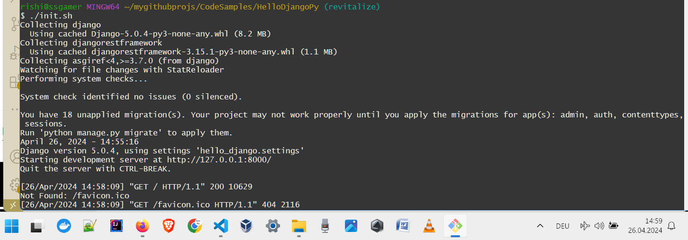

# HelloDjangoPy - To Test the Requirements for a Simple Django App

## Requirements
- python
- pip
- Shell for script execution. Bash was used during this exercise.
- any modern web browser. Firefox was used.

## Steps to Install, Create and Test (With Screenshots)
- Run the initialization script. Make sure it is executable.

- The output listing of the script may resemble this:

- View your DJango app in any modern web browser 

## Contact Pointers
- **LinkedIn:** <https://www.linkedin.com/in/rishirajopenminds>
- **X:** <https://twitter.com/RishiRajDevOps>
- **Start Page:** <https://bio.link/rishiraj49de>
- **GitHub:** <https://github.com/rishiraj88>
